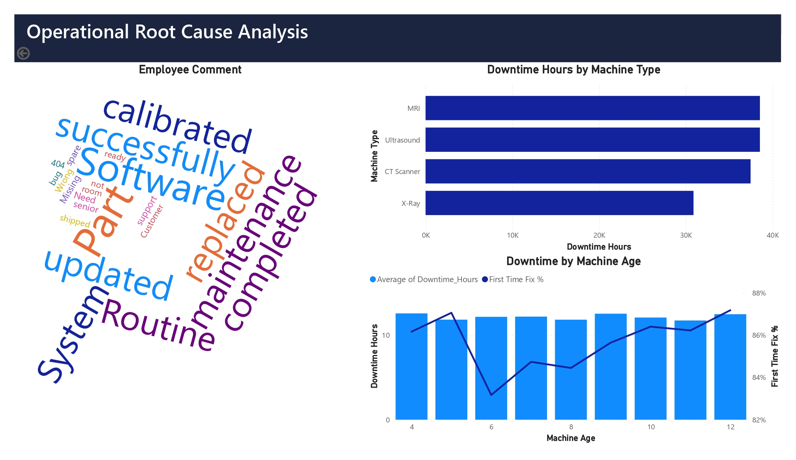
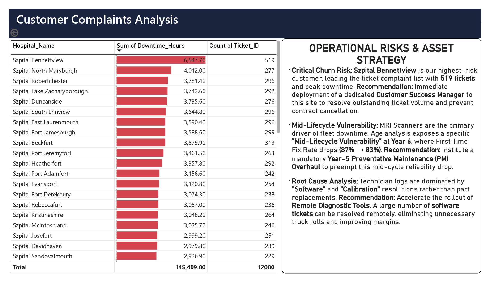
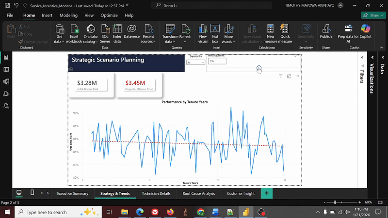
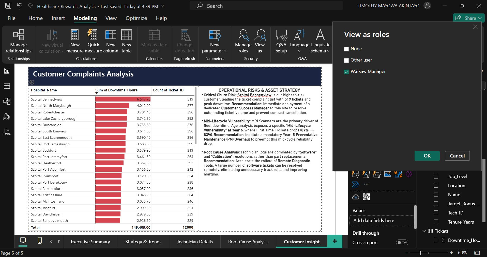
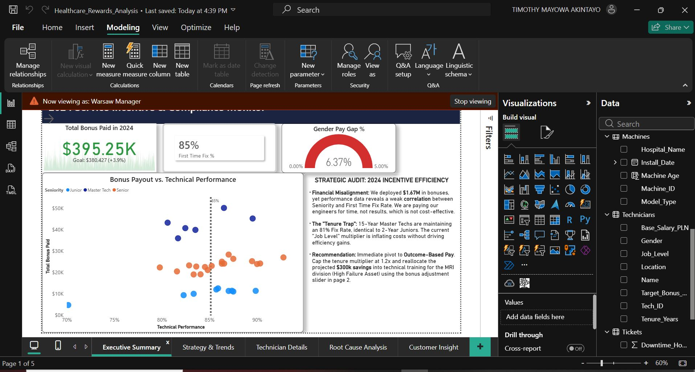

# Healthcare Operations: $300K Efficiency Recovery


## Impact at a Glance
* **$300K** annual cost optimization identified through compensation structure analysis.
* Churn-risk detection system flagged high-value customers receiving substandard service.
* Asset lifecycle mapping revealed critical Year-6 vulnerability high repeat service calls annually.

## The Problem
A global healthcare equipment provider was spending *$1.67M* annually in service bonuses yet First Time Fix Rates remained stuck at 85%. Customer complaints were climbing. Downtime hours were increasing. Leadership suspected that the current "Time-Based" incentive model was rewarding seniority rather than technical performance, but had no data to prove it. I was brought in to find out where the money was going and why it wasn't improving outcomes.

**Tools Used:** Power BI, DAX, Power Query.
**Key Achievement:** 
* Identified a "Tenure Trap" inefficiency and proposed a model to save **$300k annually** while improving asset uptime.
* Recognized customers experiencing poor service deliveries by the company and potentially stopped them from churning.
* Identified healthcare machines sold by the company that clients had the most downtime hours  with, and how the age of these machines continously affected their ability to be fixed without repeatedly breaking down.

---

## Key decision: 
Instead of analyzing technicians in isolation, I cross-referenced performance against machine age, asset type, and customer tier. This revealed patterns invisible in traditional HR dashboards.

---

**Key Business Questions:**
* Does paying more for Seniority yield better Technical Performance?
* At what stage in the machine lifecycle do failure rates spike?
* Which asset class (MRI, CT, X-Ray) drives the majority of downtime hours?

---

## Tech Stack & Methodology
* **Data Modeling:** Star Schema connecting `Fact_Tickets` (12,000 rows) to `Dim_Technicians`, `Dim_Machines`, and `Dim_Calendar`.

  
  *(Snapshot of the Entity Relationship Diagram)*
  
* **Advanced DAX:** Used `SELECTEDVALUE` and disconnected tables to create a **"What-If" Scenario Slider**, allowing stakeholders to forecast budget impacts dynamically.
* **Visualization:** Custom "Dip & Recovery" charts to track asset lifecycle vulnerability.

---

## Key Insights & Recommendations

### 1. The "Tenure Trap"
**Finding:** 15-Year Master Techs maintained an **81% Fix Rate**, identical to 2-Year Junior Techs despite commanding significantly higher compensation packages.
* **Impact:** The organization was paying a premium for tenure without receiving efficiency gains from the senior employees. Tenure was being rewarded. Competency wasn't.
* **Action:** Pivot to **Outcome-Based Pay**. Cap tenure multipliers at 1.2x and reallocate savings to training employees; specifically the junior employees that are showing great potential at being good assets to the organization. Training them on how to fix MRI which is the company's equipment that had the highest break down would improve efficiency and service delivery to our clients.

### 2. The Mid-Lifecycle Crisis
**Finding:** Age analysis exposed a specific vulnerability at **Year 6**, where Fix Rate drops from 87% to 83%.

  
  *(Snapshot of the Dip in year 6 based on the machine age)*
  
* **Root Cause:** Original factory components fail simultaneously around the 6-year mark. We weren't dealing with technician incompetence we were dealing with predictable mechanical decay.
* **Action:** Instead of blaming the technicians. I recommend that the company institutes a mandatory **Year-5 Preventative Maintenance Overhaul** in view of preventing the great damage that leads to low first time fix in year 6.

### 3. Critical Asset Risk
**Finding:** **MRI Scanners** were identified as the primary driver of downtime amongst all the machines offered by the organization. It accounted for the highest volume of downtime hours.
* **Action:** Targeted technical training funded by the $300k bonus savings can help to produce better engineers who can adequately fix the MRI scanners and improve efficiency for customers, and ultimately lower the downtime.

---

### 4. Customers at Risk of Churning
**Finding:** **Szpital Bennettview hospital** has had the highest downtime hours (6548 hours) with their machines in the last two years, and have raised (519) tickets, there is a potential risk of this customer churning if immediate action is not taken to solve their recurrent machine failure.
* **Action:** Deploy 2-3 of our best engineers (Engineers with above 90% First Time Fix %) alongside a competent customer success manager to this hospital to resolve their machine problem and prevent customer cancellation. Similar solution should be extended to other customers with high downtime hours and ticket complaints. 

  
  *(Snapshot of the customer downtime hours and count of ticket complaints)*

## Dynamic Budget Forecasting
I implemented a parameter table to allow leadership to test new bonus structures in real-time. This would help to forecast what happens when we increases the total bonus in a specific year or when we increase it for specific reasons (For instance for targeted roles) where we need highly qualified technicians (engineers). This would help to evaluate the cost-benefit impact of the reduction or increment.
  
  
*(Snapshot: Real-time calculation of budget impact using the slider)*

**Parameter Table Generation:**
```dax
Bonus Adjustment = GENERATESERIES(-0.5, 0.5, 0.05)
```

**Forecast Measure:**
```dax
Projected Bonus Cost = 
VAR Adjustment = 'Bonus Adjustment'[Bonus Adjustment Value]
RETURN
[Total Bonus Paid] * (1 + Adjustment)
```
---

## Row-Level Security (RLS) Filter
I implemented a Row-Level Security (RLS) Filter on the Dim_Technicians table to restrict data access. A specific role was created for the Warsaw Regional Manager.




*(Snapshot: Row Level Security filter and output to the report)*

---
## 📁 Project Structure
```text
Healthcare-Service-Operations-Analytics/
│
├── dashboard/
│   └── Service_Incentive_Monitor.pbix
│
├── calculations/
│   └── key_dax_measures.md
│
├── docs/
│   └── Service_Incentive_Monitor.pdf
│
├── images/
│   ├── ops_dashboard_banner.png
│   ├── scenario_slider_demo.gif
│   ├── machine_age_chart.png
│   └── data_model_ops.png
│
├── data/
│   └── Service_Incentive_Monitor.xlsx
│
└── README.md
``` 

---
### Note: 
Data has been anonymized and aggregated for confidentiality.